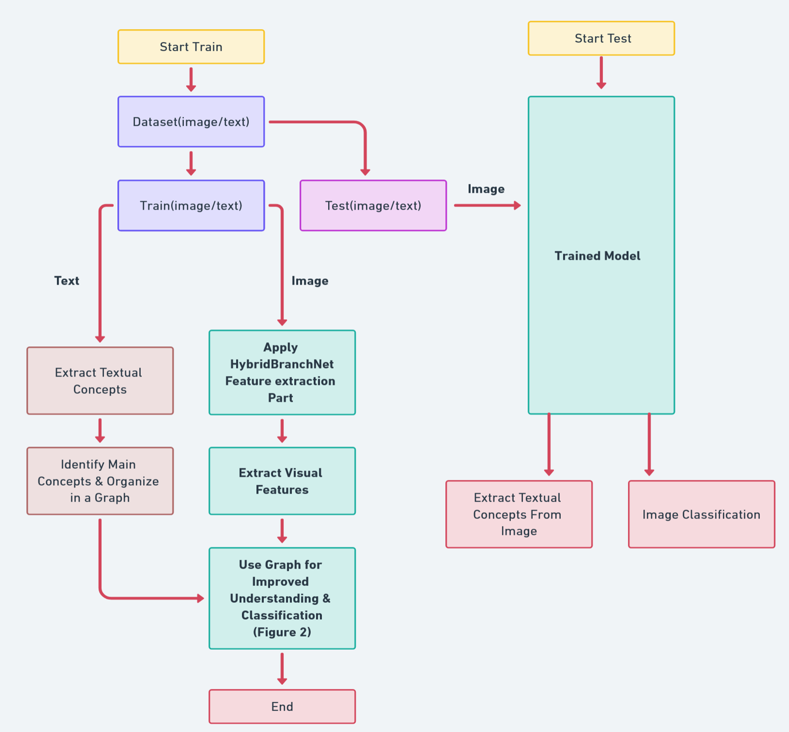

# Evaluation Results

## Table 1: Accuracy in CIFAR-100 Dataset and Comparison with Other Methods

| Model                               | Accuracy | Parameters |
|-------------------------------------|---------:|-----------:|
| EffNet-L2                           | 96.08%   | ≈ 480M     |
| EffNet-L2 [32]                      | 93.95%   | ≈ 37M      |
| MViT-B-16 [33]                      | 87.80%   | ≈ 67M      |
| Oct-ResNet-152 (SE) [34]            | 91.70%   | ≈ 64M      |
| EfficientNet-b7 Tan and Le [35]     | 92.26%   | ≈ 120M     |
| EfficientNetV2-L [36]               | 92.27%   | ≈ 54M      |
| EfficientNetV2-M [37]               | 83.64%   | ≈ 25M      |
| ResNet-50 (Fast AA) [38]            | 83.95%   | ≈ 105M     |
| HybridBranchNet3 [9]                | 92.30%   | ≈ 9M       |
| HybridBranchNetV2                   | 98.25%   | ≈ 16M      |

## Table 2: Accuracy in Flowers-102 Dataset and Comparison with Other Methods

| Model                               | Accuracy |
|-------------------------------------|---------:|
| EffNet-L2                           | 99.65%   |
| MViT-B-16                           | 98.50%   |
| Oct-ResNet-152 (SE)                 | 98.21%   |
| EfficientNet-b7 Tan and Le          | 98.80%   |
| EfficientNetV2-L                    | 98.80%   |
| EfficientNetV2-M                    | 98.50%   |
| ResNet-50 (Fast AA)                 | 97.90%   |
| HybridBranchNet3                    | 98.80%   |
| HybridBranchNetV2                   | 99.88%   |

The results presented in Table 4 provide intriguing insights when fine-tuning the proposed architecture exclusively with the Visual Genome dataset, eliminating the dependency on the ImageNet dataset.

### Effectiveness of Feature Extraction

HybridBranchNetV2 notably achieved an accuracy of 79.5% when exclusively fine-tuned using the Visual Genome dataset. This outcome implies that our architecture can adeptly extract features, enabling generalization across a more expansive range of object categories without necessitating the ImageNet dataset.

## Table 3: Accuracy in ImageNet 1K Dataset and Comparison with Other Methods Trained with Visual Genome, ImageNet

| Model                               | Accuracy |
|-------------------------------------|---------:|
| EffNet-L2                           | 88.3%    |
| MViT-B-16                           | 86.4%    |
| Oct-ResNet-152 (SE)                 | 82.9%    |
| EfficientNet-b7 Tan and Le          | 84.3%    |
| EfficientNetV2-L                    | 87.3%    |
| EfficientNetV2-M                    | 86.1%    |
| ResNet-50 (Fast AA)                 | 79.8%    |
| HybridBranchNet3                    | 83.1%    |
| HybridBranchNetV2                   | 89.4%    |

## Table 4: Accuracy in ImageNet 1K Trained Model with Visual Genome

| Model              | Accuracy |
|--------------------|---------:|
| HybridBranchNet3   | 65.2%    |
| HybridBranchNetV2  | 79.5%    |

Model Adaptability: In this setting, HybridBranchNetV2's ability to register a markedly high accuracy, especially when compared to HybridBranchNet3's 65.2%, underscores its adaptability and robust feature extraction prowess.

Reduced Dependence on ImageNet: These results further accentuate that our designed architecture can reduce its dependency on the ImageNet dataset while still maintaining effectiveness. This makes it suitable for situations where procuring ImageNet data might pose challenges or be restricted.

In conclusion, the findings highlight the versatility and feature extraction proficiency of our architecture, especially evident in HybridBranchNetV2, even without depending on the ImageNet dataset. This suggests its potential for optimal performance
